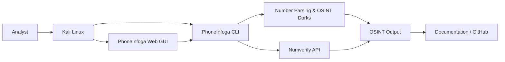

<div align="center">


# PhoneInfoga — Installation, API Integration & OSINT Lab

**A practical Kali Linux laboratory for phone-number OSINT, API enrichment, CLI scanning, Web GUI usage, and environment cleanup.**

[](https://github.com/sundowndev/phoneinfoga)
[](https://www.kali.org/)
[](https://github.com/sundowndev/phoneinfoga)
[](https://numverify.com/)
[](https://www.markdownguide.org/)

</div>

---

## Table of Contents

- [1. Project Overview](#1-project-overview)
- [2. Purpose of the Research](#2-purpose-of-the-research)
- [3. Objectives](#3-objectives)
- [4. Tools & Technologies Used](#4-tools--technologies-used)
- [5. Project Architecture](#5-project-architecture)
- [6. Project Structure](#6-project-structure)
- [7. Repository & Documentation](#7-repository--documentation)
- [8. Installation on Kali Linux](#8-installation-on-kali-linux)
- [9. Basic CLI OSINT Scanning](#9-basic-cli-osint-scanning)
- [10. Numverify API Integration](#10-numverify-api-integration)
- [11. Web GUI](#11-web-gui)
- [12. Cleanup & Environment Teardown](#12-cleanup--environment-teardown)
- [13. Quick Reference](#13-quick-reference)
- [14. Key Learning](#14-key-learning)
- [15. Limitations](#15-limitations)
- [16. Ethical & Legal Considerations](#16-ethical--legal-considerations)
- [17. References](#17-references)
- [18. Author](#18-author)

---

## 1. Project Overview

**PhoneInfoga** is an Open Source Intelligence (OSINT) framework for analyzing international phone numbers.

This laboratory documents the complete workflow used to:

- install PhoneInfoga on **Kali Linux**;
- verify the installed binary;
- perform basic phone-number OSINT from the command line;
- enrich results through the **Numverify API**;
- launch and use the PhoneInfoga **Web GUI**;
- clean up temporary files and deactivate the working environment.

### Core Capabilities Explored

| Capability | What was explored |
|---|---|
| Number parsing | Local, E.164, international and country-code formatting |
| OSINT search support | Search-engine dorks generated from a target number |
| Metadata | Country and validity-related information |
| API enrichment | External lookup through Numverify |
| Web interface | Browser-based interactive lookup |
| Environment management | Installation, cleanup and virtual-environment teardown |

> **Note:** This repository documents a learning laboratory. It does not claim that a phone number can be used to reliably identify a specific person.

---

## 2. Purpose of the Research

The purpose of this research/lab is to understand how **phone-number OSINT workflows** can be conducted in a controlled environment using publicly available tooling.

The practical focus is to examine how PhoneInfoga can:

1. parse and normalize international phone numbers;
2. generate search-engine queries that support OSINT investigation;
3. enrich technical results through an external verification API;
4. present results through both CLI and Web GUI interfaces; and
5. demonstrate responsible documentation of an OSINT workflow on GitHub.

This project is intended to strengthen practical cybersecurity and OSINT documentation skills rather than to establish the identity, location, or private information of an individual.

---

## 3. Objectives

### Primary Objective

To install, configure, test, and document a PhoneInfoga-based phone-number OSINT workflow on Kali Linux.

### Specific Objectives

- Set up PhoneInfoga correctly on Kali Linux.
- Verify the binary installation and version.
- Conduct a basic scan using a phone number in E.164 format.
- Understand the information produced without an external API.
- Configure Numverify for additional number metadata.
- Run PhoneInfoga through its Web GUI.
- Practice safe handling of API credentials.
- Document commands, observations, lessons learned, and limitations.

---

## 4. Tools & Technologies Used

| Tool / Technology | Purpose |
|---|---|
| **Kali Linux** | Security-testing and OSINT laboratory environment |
| **PhoneInfoga** | Phone-number OSINT and analysis framework |
| **Numverify API** | External phone-number lookup / metadata enrichment |
| **Bash** | Command-line execution and environment management |
| **curl** | Downloading the PhoneInfoga installation script |
| **Web Browser** | Accessing the PhoneInfoga local Web GUI |
| **GitHub** | Version control and project documentation |
| **Markdown** | README and technical documentation format |
| **Python virtual environment** | Optional isolated environment management |

---

## 5. Project Architecture

The workflow can be represented as follows:



### Architecture Flow

**Analyst → Kali Linux → PhoneInfoga → OSINT/API processing → Results → Documentation**

The local Web GUI provides an alternate interface to the PhoneInfoga workflow. The Numverify API acts as an external enrichment source when an API key is configured.

---

## 6. Project Structure

A clean GitHub repository can use the following structure:

```text
phoneinfoga-osint-lab/
├── README.md
├── assets/
   └── phoneinfoga-logo.svg
├── screenshots/
│   ├── 01-installation.png
│   ├── 02-version-check.png
│   ├── 03-cli-scan.png
│   ├── 04-api-integration.png
│   └── 05-web-gui.png
├── notes/
│   └── observations.md
└── LICENSE
```

### Structure Notes

- `README.md` — main project documentation.
- `assets/` — logo and other visual assets.
- `screenshots/` — evidence from the laboratory.
- `notes/` — extended observations or supporting notes.
- `LICENSE` — repository licensing information.

> Screenshots listed above are recommended filenames for organizing evidence. They should only be committed after the corresponding images have actually been captured.

---

## 7. Repository & Documentation

### Official Repository

PhoneInfoga is maintained by **sundowndev**:

<https://github.com/sundowndev/phoneinfoga>

### Official Documentation

<https://sundowndev.github.io/phoneinfoga/>

The documentation should be consulted for supported installation methods, commands, features, and project-specific changes.

---

## 8. Installation on Kali Linux

### 8.1 Activate a Virtual Environment (Optional)

If the lab is being managed inside a Python virtual environment:

```bash
source venv/bin/activate
```

If the virtual environment does not exist yet, create one with:

```bash
python3 -m venv venv
```

Then activate it:

```bash
source venv/bin/activate
```

### 8.2 Download & Install the PhoneInfoga Binary

Run the installation script:

```bash
bash <(curl -sSL https://raw.githubusercontent.com/sundowndev/phoneinfoga/master/support/scripts/install)
```

The installation process downloads the appropriate compiled binary and places a local `phoneinfoga` executable in the working directory.

### 8.3 Install the Binary Globally

Move the executable into `/usr/local/bin/`:

```bash
sudo install ./phoneinfoga /usr/local/bin/phoneinfoga
```

This makes the command available system-wide.

### 8.4 Verify the Installation

Check the installed version:

```bash
phoneinfoga version
```

Example output observed in the original lab:

```text
PhoneInfoga 2.11.0-5f6156f
```

> Version output can change as the project is updated. Treat the example above as the version observed during this lab, not as a guaranteed current release.

---

## 9. Basic CLI OSINT Scanning

PhoneInfoga can scan a target number in **E.164 format**.

Example:

```bash
phoneinfoga scan -n +23491****1330
```

The number shown above is intentionally masked for documentation and privacy.

### Information Observed

The scan can provide information such as:

- Google search dorks;
- local number formatting;
- E.164 formatting;
- international formatting;
- country code / country information.

Example formatting observed:

```text
Raw local:       091****1330
Local:           0916 *** 1330
E164:            +23491****1330
International:  23491****1330
Country:         NG
```

### OSINT Search Dorks

PhoneInfoga can generate search URLs/dorks intended to help an analyst investigate publicly indexed references associated with the number.

These results should be treated as **leads for verification**, not as proof that a specific person owns or controls a number.

---

## 10. Numverify API Integration

### 10.1 Obtain an API Key

Numverify is provided through the API Layer ecosystem.

Reference:

<https://numverify.com/>

Do not publish a real API key in GitHub commits, screenshots, README files, or terminal recordings.

### 10.2 Run a Scan with the API Key

Use an environment variable rather than hard-coding a secret:

```bash
numverify_API_KEY="YOUR_NUMVERIFY_API_KEY" \
phoneinfoga scan -n +23491****1330
```

Alternatively:

```bash
export numverify_API_KEY="YOUR_NUMVERIFY_API_KEY"
phoneinfoga scan -n +23491****1330
```

### Credential-Safety Rule

Never commit this type of value:

```text
numverify_API_KEY="REAL_SECRET_KEY"
```

Use a placeholder when documenting the workflow:

```text
numverify_API_KEY="YOUR_NUMVERIFY_API_KEY"
```

If a secret has ever been exposed publicly, revoke or rotate it through the provider rather than simply deleting the text from the README.

---

## 11. Web GUI

PhoneInfoga also provides an interactive local Web interface.

### 11.1 Start the Web Server

```bash
phoneinfoga serve -p 5000
```

The lab output displayed a local listener similar to:

```text
Listening on :5000
```

### 11.2 Open the Interface

In a web browser, visit:

<http://localhost:5000/#/>

Then:

1. Select the required country code.
2. Enter the phone number.
3. Select **Lookup**.
4. Review the returned formatting, validity, and country information.

### CLI vs Web GUI

| Interface | Advantage |
|---|---|
| CLI | Fast, scriptable and convenient for terminal-based workflows |
| Web GUI | More visual and accessible for interactive lookups |

---

## 12. Cleanup & Environment Teardown

After the laboratory work is complete, remove temporary files and deactivate the environment.

### 12.1 Remove the Local Binary

Because the binary was already installed in `/usr/local/bin/`:

```bash
rm phoneinfoga
```

### 12.2 Deactivate the Virtual Environment

```bash
deactivate
```

### 12.3 Verify the Working Directory

```bash
pwd
```

A final directory check helps confirm that temporary laboratory files have been removed as expected.

---

## 13. Quick Reference

| Stage | Command |
|---|---|
| Create virtual environment | `python3 -m venv venv` |
| Activate virtual environment | `source venv/bin/activate` |
| Install PhoneInfoga | `bash <(curl -sSL https://raw.githubusercontent.com/sundowndev/phoneinfoga/master/support/scripts/install)` |
| Install binary globally | `sudo install ./phoneinfoga /usr/local/bin/phoneinfoga` |
| Verify version | `phoneinfoga version` |
| Basic scan | `phoneinfoga scan -n <NUMBER>` |
| API scan | `numverify_API_KEY=<KEY> phoneinfoga scan -n <NUMBER>` |
| Start Web GUI | `phoneinfoga serve -p 5000` |
| Remove local binary | `rm phoneinfoga` |
| Deactivate virtual environment | `deactivate` |

---

## 14. Key Learning

### 1. Phone-number OSINT is primarily an information-correlation task

A tool can parse and enrich a number, but the resulting data still requires interpretation and independent verification.

### 2. E.164 formatting is useful for international analysis

Using a standardized international representation helps tools consistently parse and process phone numbers.

### 3. API integration can enrich an investigation

External lookup providers can add information that may not be available from local parsing alone. This also introduces dependency on API availability, quotas, and provider data quality.

### 4. CLI and GUI workflows serve different purposes

The CLI is efficient for repeatable technical workflows, while the Web GUI offers a more interactive user experience.

### 5. Secrets must be separated from documentation

API credentials should be supplied at runtime through environment variables or a secure secrets mechanism rather than stored directly in GitHub.

### 6. Documentation is part of the technical skill

A reproducible README, structured evidence, clean screenshots, and clear limitations make a cybersecurity laboratory easier to review and reproduce.

---

## 15. Limitations

This laboratory has several limitations:

- **Public-data dependency:** OSINT results depend on what is publicly indexed or available through the selected provider.
- **Data accuracy:** External API information may be incomplete, outdated, or incorrect.
- **Rate limits:** API services may restrict the number of requests available to a user or plan.
- **Search-engine variability:** Search dorks do not guarantee useful or accurate results.
- **No identity guarantee:** A phone number appearing in a public source does not, by itself, prove the identity of its owner.
- **Geographic limitations:** Phone prefixes and numbering information do not necessarily reveal the physical location of a device or person.
- **Tool/version changes:** Commands, output formats, and supported features can change between PhoneInfoga releases.

---

## 16. Ethical & Legal Considerations

Phone-number OSINT should be performed only for lawful and authorized purposes.

Recommended practice:

- Use numbers that you own, numbers provided for a legitimate assessment, or deliberately authorized laboratory targets.
- Avoid unnecessary collection of personal information.
- Do not publish private or sensitive data in screenshots or GitHub issues.
- Mask phone numbers in public documentation where the full value is not required.
- Never expose API keys or other credentials.
- Treat OSINT results as evidence requiring validation, not as automatically verified facts.

---

## 17. References

1. **PhoneInfoga — GitHub Repository**  
   <https://github.com/sundowndev/phoneinfoga>

2. **PhoneInfoga — Official Documentation**  
   <https://sundowndev.github.io/phoneinfoga/>

3. **Numverify — Phone Number Validation API**  
   <https://numverify.com/>

4. **Kali Linux — Official Website**  
   <https://www.kali.org/>

5. **Markdown Guide**  
   <https://www.markdownguide.org/>

---

## 18. Author

### Diane Ally Lamine

**Cybersecurity / OSINT Learner**

GitHub: **Fresh-Mhizta-Lead**

This project forms part of a practical cybersecurity learning portfolio focused on security tooling, OSINT workflows, laboratory documentation, and reproducible technical practice.

---

<div align="center">

**Built for learning, documentation, and responsible security research.**

⭐ *Document the process. Verify the evidence. Protect the data.*

</div>
